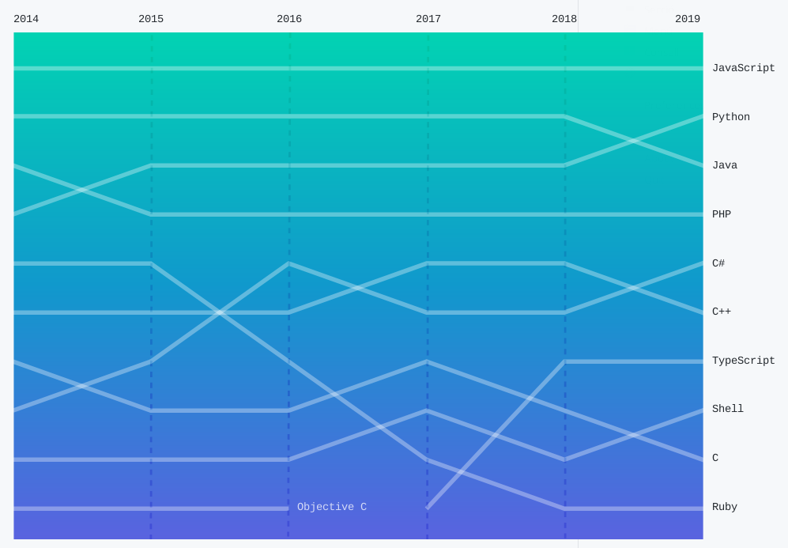

## 1. Introducció

Nodejs és un runtime o entorn d'execució construit sobre el motor de Javascript V8 de Google Chrome, i que ens permet fer ús d'aquest llenguatge per desenvolupar qualsevol tipus d'aplicació multiplataforma. A més, al tractar-se d'un llenguatge lligat inicialment al món web, tenim la possibilitat de crear aplicacions d'escriptori fent ús de tecnologíes com HTML5 i CSS.

Al lloc Octoverse (https://octoverse.github.com/) creat per Github, es mostra un informe annual de les tendències en quant a desenvolupament de programari lliure, realitzat a través dels milions de projectes que aquest portal allotja. En aquest informe, podem veure com Javascript és de lluny el llenguatge que més projectes de programari lliure utilitzen, seguit de Python en segon lloc i de Java en tercer.

{ width="400px" }

> **Documentació oficial**
>
> Lloc oficial a la documentació de Node.js: [https://nodejs.org/en/docs/](https://nodejs.org/en/docs/)

### 1.1. Evolució de Javascript

La primera versió de Javascript va ser dissenyada el 1995 per Netscape, amb la intenció de donar inicialment capacitat als navegadors per a la validació de formularis, sense necessitat d'enviar les dades al servidor per ser validades en temps on la velocitat en les comunicacions era molt limitada. Esta primera versió, inicialment anomenada LiveScript, passà a nomenar-se javaScript per pur màrqueting (java estava de moda a l'època).
L'any 1997 s'estandaritza el llenguatge, donant lloc a la norma ECMA-262 ( European Computer Manufacturers Association), conegut com ECMAScript. La ISO va adoptar l'ECMA-262 donant lloc a l'estàndard ISO/IEC-16262.


Des d'aleshores, el llenguatge ha anat evolucionant i guanyant en capacitat. Veiem a la següent taula com ha estat aquesta evolució a través de les diferents versions d'ECMAScript:

| Versió ES  | Data de publicació | Principals característiques     |
|-----------|------------|-------------|
|  ES1        | Juny de 1997 |  Primera edició estàndard         |
| ES2       | Juny de 1998 | Aliniació amb l'estàndard internacional ISO/IEC 1626 |
|  ES3  |   Desembre de 1999 | S'incrouen expressions regulars<br/>Millora la gestió d'strings<br/>Gestió d'excepcions (try/catch)<br/>Millora en els formats d'eixida |
| ES4 | Abandonada |  Abandonada deguda a la complexitat del llenguatge|
| ES5 | Desembre de 2009 | S'inclou el mode strict, per evitar errors<br/>Suport de JSON<br/>Millores amb les propietats dels objectes |
| ES5.1 |  Juny de 2011 |  Aliniament amb la norma ISO 1626:2011 |
| ES6/ECMAScript 2015 | Juny de 2015 | Inclussió de classes i mòduls<br/>Iteradors for/of per a bucles<br/>generadors i generadors d'expressions a l'estil de python,<br/>funcions de direcció, dades binàries, col·lecions (mapes, sets, mapes febles), proxies... |
| ES7/ECMAScript 2016 | Juny de 2016 | Millores en el llenguatge: aïllament de codi, control d'efectes i llibreries,<br/>Incorporació de característiques com les promeses i la concurrència, l'operador d'exponent (**) o la recerca en vectors amb Array.prototype.includes. |
| ES8/ECMAScript 2017 | Juny de 2017 | Incorpora noves característiques relacionades amb la concurrència, gestió de memòria, operacions matemàtiques, integració sintàctica amb promeses, computació paral·lela, i millores amb l'orientació a objectes la sobrecàrrega d'operacions, tipus, registres, tuples i trets (traits). |
| ES9/ES2018 | Juny de 2018 | Millores en les expressions regulars<br/>Operador ... de resta de conjunt<br/>S'afig finally a les promeses<br/>Iteracions asíncrones| 
| ES10/ES2019 | Juny de 2019 | Noves funcions per a la manipulació d'Arrays i objectes, treball am strings, <br/> Ús del `catch` en la captura d'excepcions de forma genèrica<br/>Millor integració entre JSON i ECMAScript<br/>Altres millores en la conversió a strings de JSON, ordenació de vetors, <br/>millores en la funció toString |

Al llarg de la seua història, podem veure com Javascript ha anat convertint-se d'un llenguatge pensat inicialment per al seu funcionament dins el navegador web per a temes de validacions fins a un llenguatge complet per a entorns també de servidor o escriptori, prestant la mateixa funcionalitat que altres com C#, Python o Java. A més, amb el valor afegit de la seua facilitat per gestionar contingut web, el que ens permet desenvolupar interfícies d'usuari amb aquestes tecnologies.

### 1.2. El motor V8. Javascript interpretat o compilat?

Com hem comentat, node.js es basa en el motor de Javascript V8 del navegador web Google Chrome. Aquest motor és qui s'encarrega de la compilació i execució del codi Javascript transformant-lo en codi màquina,així com d'ubicar els elements necessaris en memòria i eliminar d'ella els que no s'utilitzen (*garbage collector*)

Tot i que moltes fonts, Wikipèdia inclosa, cataloguen Javascript com  un llenguatge interpretat o híbrid, aquest és un llenguatge compilat. Aquesta confusió es deu, a que Javacript no es compila amb l'antel·lació amb la que ho fan altres llenguatges tradicionals compilats, com puga ser C, i a que no obtenim un resultat "palpable" d'aquest procés de compilació (un fitxer objecte o executable).

Com hem dit, Javascript és una implementació de l'estàndard ECMAScript. Doncs bé, aquest estàndard, en la seua especificació requereix que els errors prematurs (*Early Errors*) s'analitzen abans que s'execute qualsevol línia. Si es tractara d'un llenguatge purament interpretat i hi ha un error en la línia 1000 d'un programa, s'haurien d'executar abans les 999 línies precedents, amb el que no es compliria aquesta regla: "*Una implementació conforme (als estàndards)  ha de, abans de la primera avaluació d'un Script o mòdul, validar totes ler regles d'errors prematurs de les produccions utilitzades per analitzar l'script o mòdul. Si s'infringeig alguna de les regles d'error anticipades, la seqüència d'ordres o el mòdul no són vàlids, i no es poden avaluar*" (https://tc39.github.io/ecma262/#sec-static-semantic-rules)

El motor V8 realitza una compilació en dues passades, una primera més ràpida però no optimitzada (estratègia Inline Caché), i una segona optimitzada, a partir de la primera.

També cal dir que V8 està escrit en C++, és de codi obert i s'utilitza en navegadors com Google Chrome i totes les seues variants, a banda, evidentment de node.js, i pot executar-se en qualsevol sistema operatiu i arquitectura, sent una de les tecnologíes multiplataforma més reconegudes.

Inicialment, Javascript estava concebut per ser executat dins un navegador, pel que no tenía sentit, per exemple l'accés al sistema de fitxers, als processos del sistema o interactuar amb una base de dades. Node.js, basant-se en aquest motor V8, ha afegit una capa de funcionalitat per tal que poguem realitzar aquestes tasques, convertint-lo en un llenguatge molt apropiat per a aplicacions d'escriptori. Per altra banda, també s'han incorporat capacitats de comunicacions i d'atendre a peticions a través de la xarxa, el que fa que també s'haja convertit en una molt bona opció per a entorns de servidor.

> **Font**
>
> [https://medium.com/@pharesdiego/javascript-un-lenguaje-compilado-o-interpretado-962ee405e123](https://medium.com/@pharesdiego/javascript-un-lenguaje-compilado-o-interpretado-962ee405e123)

### 1.3. Característiques principals de Node.js

D'entre les característiques de nodejs, podríem destacar:

* Ofereix un paradigma de **programació basada en esdeveniments**, a través d'una **API asíncrona** que no bloqueja el programa principal mentre espera una resposta, sinò que segueix l'execució principal fins que es rep la resposta.
* L'execució de codi és molt ràpida,
* Es basa en un **model monofil molt escalable**: Només hi ha un fil d'execució atenent peticions, però que gràcies a l'API asíncrona i dirigida per esdeveniments, es poden atendre múltiples peticions per aquest fil, arribant a consumir molts menys recursos que un sistema multifil.
* Com que l'execució no es realitza dins el navegador, s'elimina la necessitat de desenvolupar codi compatible amb cada navegador. 

### 1.4. On podem trobar Node.js?

Nodejs es troba segurament en més llocs dels que podem imaginar. Veiem una llista d'aplicacions on s'utilitza node.js, tant des del costat de servidor com d'aplicacions d'escriptori, mitjançant dues tecnologíes que es recolzen en node.js i que li aporten una interfície basada en HTML5: nwjs (https://nwjs.io/) i Electron (https://electronjs.org/).

* Entorns de servidor: Netflix, Paypal, LinkedIn, Ebay, NASA, Mozilla, Uber, Yahoo, Groupon(http://inubo.es/noticia/los-10-mejores-ejemplos-de-aplicaciones-node-js-para-empresas, https://brainhub.eu/blog/9-famous-apps-using-node-js/)
* Aplicacions d'escriptori basades en Electron (https://electronjs.org/apps): Skype, Whatsapp, Slack, Atom, Visual Studio Code, Github Desktop
* Aplicacions basades en nwjs (https://github.com/nwjs/nw.js/wiki/List-of-apps-and-companies-using-nw.js): Haroopad, Reditr, TweetDeck, Kindle Cloud Reader.

## 2. Primeres passes amb Nodejs

### 2.1. Instal·lació

En Ubuntu, nodejs ja vé instal·lat de sèrie, en la seua versió 10.19.0~dfsg-3ubuntu1 (Ubuntu 20.04 LTS) a data de desembre de 2020.

Si desitgem la última versió, podem descarregar el paquet des de la pròpia web de nodejs, on es troben les últimes versions oficials (14.15.1 LTS o 15.3.0 Current). La diferèncie entre ambdues és que la LTS es considera estable i és de suport ample, mentre que la Current incorpora les últimes novetats, a canvi de perdre una mica d'estabilitat (podríem dir que és una beta de la pròxima versió LTS).

Si optem per descarregar aquesta versió, veurem que no es troba en forma de paquet, sinò que és un fitxer comprimit, pel que caldria desomprimir-lo i copiar cada cosa al seu lloc. Per altra banda, al repositori NodeSource de Github es troben uns scripts per facilitar-nos la instal·lació des del gestor de paquets del sistema: https://nodejs.org/es/download/package-manager/#distribuciones-de-linux-basadas-en-debian-y-ubuntu. El que caldrà fer en aquest cas serà:

```console
$ sudo apt-get update
$ sudo apt-get install curl
$ curl -sL https://deb.nodesource.com/setup_15.x | sudo -E bash -
$ sudo apt-get install -y nodejs
```

De totes formes, per al treball que realitzarem, ens serà suficient amb la versió que porta Ubuntu, de manera que no ens hajam de barallar amb dependències a l'hora de distribuir les nostres aplicacions.

El que ens ofereix aquest paquet, tant el que tenim preinstal·lat al sistema com si l'instal·lem de nou és el propi `node` (o el seu alias `nodejs`) i el gestor de paquets de Node.js anomenat `npm` (*Node Package Manager*)

### 2.2. Hola Node

Node.js pot llençar-se des de la pròpia terminal, amb l'ordre `node` o el seu àlias `nodejs`.

Per tal de comprovar la versió de node que tenim, farem ús de `node -v` o `node --version`:

```console
$ node -v
v10.19.0
```
Node.js admet dues formes de treball: mitjançant la consola interactiva i l'execució directa d'scripts.

### 2.3. La consola interactiva

Node.js disposa d'una consola interactiva, a la que podem accedir simplement amb `node` i llençar directament ordres:

```shell
$ node
> console.log("Hola Node");
Hola Node
undefined
```

Com podem veurem, quan llancem node, el *prompt* del sistema canvia al símbol `>`, indicant que estem dins la consola de Node. Si alguna vegada hem treballat amb la consola web del navegador, el funcionament és exactament el mateix.

Si ens fixem, hem escrit només una instrucció `console.log`, que sería l'equivalen en Java a `System.out.println`. Podem veure, com no ens ha fet falta definir cap classe principal ni cap mètode main. Javascript, tot i que suporta la programació orientada a objectes, no obliga a que tot, inclòs el programa principal estiga dins una classe. D'aquesta manera, podem tindre codi tan senzill com una simple instrucció.

Veiem també que al final ens torna un valor "undefined". Açò es deu a que la funció `console.log` no retorna cap valor (és de tipus *void*), i per tant, ens indica que el resultat que retorna la funció no està definit.

Per tal d'eixir del mode interatiu farem ús de la combinació de tecles `Ctrl+D`.

### 2.4. Execució d'scripts

La manera habitual en què funcionarem amb Node.js serà llençant l'ordre `node` sobre un script. Veiem-ho amb un senzill exemple. Tenim l'script següent, anomenat hola.js.

```javascript
if (process.argv.length==3)
        console.log("Hola "+process.argv[2])
else
        console.log("Hola Nodejs");
```

Per executar-lo, només huarem d'indicar `node` i el nom del fitxer:

```console
$ node hola.js Jose
Hola Jose
$ node hola.js 
Hola Nodejs
```
Com veiem, es tracta d'un *Hola Món* més personalitzat, on segons els paràmetres que li passem, escriurà una o altra cosa. També podem observar, com s'ha comentat abans, que no ha fet falta incloure el codi en cap classe ni funció especial. A més, veiem que podem accedir als paràmetes que passem per la línia d'ordres a través de l'objecte (vector) process.argv, que la propietat process.argv.length ens dóna la longitud d'aquest, i que la segona posició d'aquest (`process.argv[2]`) fa referència al primer paràmetre que li hem passat.

## 3. Conclussions

Node.js ha estat tota una revolució els últims anys, i ha esdevingut un dels entorns d'execució multiplataforma més populars. Les seues utilitats són múltiples, tant en entorns de servidor com en aplicacions d'escriptori, gràcies a tecnologíes com Electron i NWJS. I tot, només fent ús d'un llenguatge de programació tan conegut i estés com Javacript, amb algunes característiques addicionals per convertir-lo en un llenguatge de programció complet; així com HTML5 i CSS3 per al desenvolupament d'interfícies enriquides.

En definitiva, es tracta d'una alternativa a tot l'ecosistema Java que s'està implantant en molts projectes, i que no convé perdre de vista de cara al futur. En aquest mòdul, tot i no perdre la perspectiva assentada de Java, tindrem també en compte aquesta tecnología emergent.
