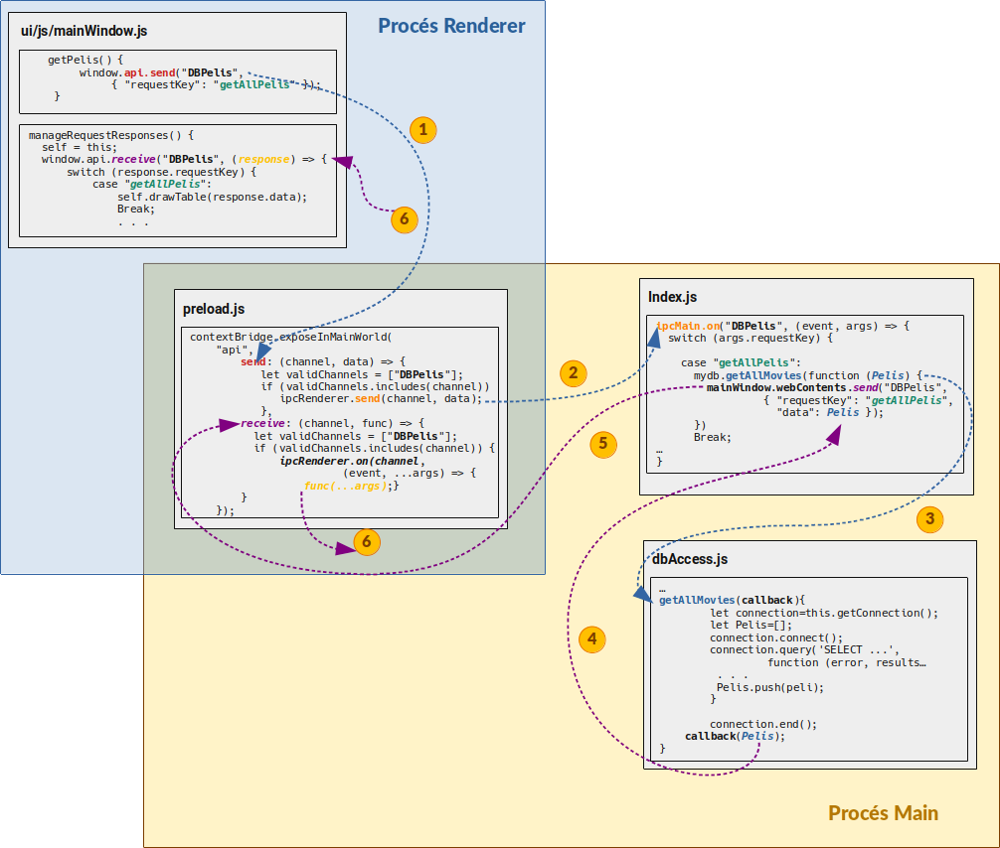

## 1. Introducció a Electron

Electron és una plataforma per al desenvolupament d'aplicacions multiplataforma mitjançant tecnologies web (HTML+CSS+Javascript).

Algunes de les aplicacions més conegudes que utilitzen aquesta tecnologia són: Visual Studio Code, Atom, Slack, WhatsApp, Skype, MS Teams, Twitch, Signal o GitHub Desktop.

El seu funcionament es basa en dos processos principals, el procés *main* i el procés *renderer*. El procés *main* és un procés de Nodejs i és el procés principal de l'aplicació que ofereix accés a les diferents APIs de nodejs per accedir als recursos del sistema. Per la seua banda, el procés *renderer* és qui s'encarrega del *renderitzat* de la interfície web, mitjançant el motor V8 de *chromium*.

### 1.1. Funcionament dels processos *main* i *renderer*

El procés principal de l'aplicació *main* pot crear diverses *finestres* gràfiques, creant diferents instàncies de la classe *BrowserWindow*. Cadascuna d'aquestes instàncies de BrowserWindow té un procés *Renderer* associat, de manera que quan uns instància de *BroserWindow* es destrueix, també ho fa el seu procés de *renderer*.

Així doncs, tindrem un procés principal que gestionarà diversos processos de renderitzat, i cadascun d'aquests processos de renderitzat gestiona una finestra o pàgina web. Quan un d'aquestos processos *renderer* falla, no afectarà doncs al procés principal ni a la resta de processos de *renderer.*

Tot i que es pot forçar l'ús de nodejs dins un procés de *Renderer* per tal d'accedir a les APIs natives de Nodejs, el seu ús està restringit i desaconsellat, ja que pot portar a potencials riscos de seguretat i pèrdues de recursos. Per tal d'evitar això, només es permet l'accés als recursos del sistema al procés principal, qui es comunicarà amb els diferent processos de *Renderer* mitjançant IPC (Inter-Process Comunication, o comunicació entre processos).

## 2. Aplicació d'exemple

En aquest exemple anem a veure com crear una aplicació d'escriptori amb Electron, que implemente la interfície gràfica amb HTML5, es comuniqeu mitjançant IPC amb el procés principal, i que aquest, ataque a una base de dades MySQL, fent ús del connector corresponent per a NodeJS.

### 2.1. Passos inicials

1. **Creació del paquet**

En primer lloc, en la nostra carpeta del projecte anem a crear l'estructura del `package.json` (la carpeta on estem s'anomena `DBElectron`):

```
$ npm init 
```

Se'ns preguntarà per alguns detalls de l'aplicació, i ens crearà el fitxer `package.json` amb una estructura mínima, que anirem ampliant.

2. **Paquets necessaris**

Per a la nostra aplicació, necessitarem principalment dos llibreríes: electron i el driver de mysql:

```
$ npm install --save electron
$ npm install --save mysql
```

Amb l'opció --save, el que fem és afegir aquestes llibreríes com a dependències del projecte dins el fitxer `package.json` (és l'opció pe defecte, si no posem *--save* té el mateix resultat).

A més d'aquestes, anem a incloure el framework bootstrap, per al disseny d'interfícies, i bootstrap-native, per no dependre de la llibrería jquery. També inclourem la tipografia *Awesome*, per a les icones de l'aplicació.

```
$ npm install --save bootstrap
$ npm install --save bootstrap.native
$ npm install --save @fortawesome/fontawesome-free
```

Amb tot açò, al `package.json` se'ns haurà generat una secció *dependencies* amb el següent contingut:

```json
    "dependencies": {
    "bootstrap": "^4.5.3",
    "bootstrap.native": "^3.0.14",
    "electron": "^11.1.0",
    "mysql": "^2.18.1"
  }
```

3. **Distribució i instal·lació**

Totes les dependències s'han instal·lat al directori `node_modules`, de la nostra aplicació. Aquesta carpeta no serà necessari distribuïr-la quan distribuim el codi font de l'aplicació, ja que disposem de la informació per a la seua generació dins el `package.json`. La majoria dels projectes nodejs que podem trobar a github ho fan d'aquesta manera.

Amb la informació que el fitxer `package.json` ens proporciona, podem regenerar totes les dependències amb:

```
$ npm install
```

Amb açò, a més, descarregarem les versions més actualitzades de les dependències cada vegada.

4. **Execució**

Per tal d'executar amb Electron l'aplicació, haurem d'afegir un script que invoque l'executable d'electron sobre el directori de la pròpia aplicació:

```json
"scripts": {
    "start": "electron ."
    }
```

Amb el que indiquem a npm que l'script `start` executarà l'ordre `electron .`. Amb açò, per executar l'aplicació, haurem d'invocar `npm` de la següent forma:

```
$ npm start
```

De moment, encara no podrem executar res perquè no hem afegit codi. Abans d'això, però, anem a veure com s'estructurarà la nostra aplicació.

### 2.2. Estructura del projecte

L'aplicació d'exemple que estem utilitzant té la següent estructura de directoris:

```
.
|-- database
|   |-- createDockerDB.sh
|   `-- DBCine.sql
|-- dbAccess.js
|-- index.js
|-- node_modules
|      `-- ...
| ...
|-- package.json
|-- package-lock.json
|-- preload.js
|-- README.md
`-- ui
    |-- css
    |   |-- bootstrap-material-design.css
    |   `-- custom.css
    |-- js
    |   `-- mainWindow.js
    `-- mainWindow.html
```

A banda dels fitxers de descripció del projecte, destaquem:

* **Carpeta database**: Conté l'script de creació de la base de dades, i un script en bash per crear o llançar un contenidor de MySQL amb Docker on s'emmgatzemarà la base de dades. Teniu més informació al fitrxer README del projecte.
* **Fitxer index.js**: Conté el procés principal de l'aplicació (*Main*), que serà qui controlarà l'aplicació i accedirà, a través de nodeJS a la base de dades.
* **Fitxer dbAccess.js**: Implementa tot l'accés a la base de dades a través del connector MySQL corresponent per a nodejs.
* **Fitxer preload.js**: Conté codi que s'injectarà en la finestra principal de l'aplicació abans de la càrrega d'aquesta, per tal de proporcionar-li accés restringit i controlat a algunes característiques de nodejs.
* **Carpeta ui**: Conté les diferents *vistes* de l'aplicació:
  * ***Fitxer ui/mainWindow.html:*** Conté el codi HTML corresponent a la finestra principal de l'aplicació. 
  * ***Fitxer ui/js/mainWindow.js***: Conté el codi Javascript que controla la interfície d'usuari. Aquest codi, en principi no tindrà capacitat per si mateix d'accedir a l'API de nodejs, sinò que ho farà a través de l'API proporcionada pel fitxer *preload.js*.
  * ***Carpeta ui/css***: Conté el codi CSS que defineix l'aspecte de l'aplicació.

### 2.3. Procés Main

El fitxer javascript que implementarà el procés *Main* és el que s'indique a la clau `"main"` del fitxer *package.json*:

```json
"main": "index.js"
```

Anem a analitzar el fitxer per parts:

* En primer lloc, carreguem la llibrería d'electron, de la que utilitzem dos classes:  `app` per controlar el cicle de vida de l'aplicació, i BrowserWindow, per tal de controlar les finestres de l'aplicació. A més, es crea una referència global a la finestra principal de l'aplicació, per tal que no es tanque quan passe el recol·lector de fem de nodejs.

```js
const {app, BrowserWindow} = require('electron')
let mainWindow;
```

* El codi que s'executa en arrancar l'aplicació **detecta l'event d'inicialització d'electron (`ready`), de manera que estiguen disponibles les APIs i poguem crear la finestra principal**:

```js
app.on('ready', function(){
  createWindow();
});
```

* Aquesta funció createWindow, crea la finestra del navegador. Si volem també les *devtools* (finestra per depurar la interfície), així com gestionar alguns events relacionats amb la finestra, també ho farem aci.

```js
function createWindow() {
  // Crea la finestra del navegador
  mainWindow = new BrowserWindow(
    {
      width: 1024,
      height: 768,
      webPreferences: {
        // Amb nodeIntegration a true, 
        // integrariem node en la pròpia
        // finestra del navegador.
        // Més senzill de gestionar, però
        // molt més insegur!
        // nodeIntegration: true
        nodeIntegration: false,
        // A més, aquesta seguretat s'incrementa amb
        // les següents opcions
        contextIsolation: true, // protect against prototype pollution
        enableRemoteModule: false, // turn off remote
        // Precàrrega de l'ipcRenderer
        preload: __dirname + '/preload.js'
      }
    }
  );

  // Podem afegir un menú a 'aplicació
  mainWindow.setMenu(null);

  //Carreguem en la finestra principal l'HTML
  // corresponent a aquesta finestra
  mainWindow.loadFile('ui/mainWindow.html')

  
  // Aquest codi comprova si hem afegit l'argument "debug"
  // per tal depurar l'aplicació amb les devtools.
  if (process.argv.length===3 && process.argv[2]==="debug"){
    // Si volem obrir les devtools en la mateixa finestra, faríem:
  //mainWindow.webContents.openDevTools();

  // I per obrir-les en una finestra a banda:
    devtools = new BrowserWindow()
    mainWindow.webContents.setDevToolsWebContents(devtools.webContents);
    mainWindow.webContents.openDevTools({ mode: 'detach' });
  }

  /* Gestió d'events de la finestra */

  // Detectem l'event de tancar la finestra principal
  mainWindow.on('closed', function () {
    // I quan es tanque, eliminem la seua referència 
    // per alliberar memòria 
    mainWindow = null
  })

}
```

Com es comenta al codi, podem *forçar* que es puga utilitzar *nodejs* en el procés de renderitzat afegint a la creació de la finestra el codi:

```js
webPreferences: {
        nodeIntegration: true
      }
```

Amb el què s'integra *node* en el procés *Renderer*. Com es comenta, açò pot suposar un problema de seguretat, en donar tota la potència de node a la finestra amb contingut web, pel que solem deshabilitar aquesta preferència:

```js
webPreferences: {
        nodeIntegration: false
      }
```

A més, per tal d'evitar altres problemes de seguretat i tenir un major control de la comunicació ente *Renderer* i *Main*, s'habilita l'aïllament de contextos (*ContextIsolation*), i es deshabilita l'ús de *remote*, altre mecanisme d'intercanviar missatges IPC entre *Main* i *Renderer*. A més, es realitza la *precàrrega* d'un fitxer `preload.js` que és qui realitzarà el control de les comunicacions, com veurem després.

```js
webPreferences: {
  nodeIntegration: false,
  contextIsolation: true, // protect against prototype pollution
  enableRemoteModule: false, // turn off remote
  preload: __dirname + '/preload.js'
}
```

Seguint amb el procés *Main*, tenim dos funcions generals més al codi per gestionar un parells d'events específics per a aplicacions en macOS (plataforma *Darwin*), que funcionen un tant diferent a plataformes Linux i Windows:

* **Event *window-all-closed***: Aquest event es dispara quan es tanquen totes les finestres de l'aplicació. En Linux i Windows, això implica el tancament de l'aplicació, però amb MacOS, les aplicacions s'han de tancar explícitament, per tant, detectem aquest tancament de les finestres i tanquem l'aplicació en cas que es tracte d'un macOS.

    ```js
    // Quit when all windows are closed.
    app.on('window-all-closed', function () {
      // On macOS it is common for applications and their menu bar
      // to stay active until the user quits explicitly with Cmd + Q
      if (process.platform !== 'darwin') {
        app.quit()
      }
    })
    ```

* **Event *activate***: Aquest event es dispara quan s'activa l'aplicació. Les accions que el desencadenen poden diversos, com iniciar l'aplicació per primera vegada, recarregar l'aplicació quan ja està en funcionament, o fer clic sobre l'aplicació al dock o a la icona a la barra de tasques. Quan es produeix aquest event, comprovarem si la finestra principal existeix, i si no és així, la crearem.

```js
app.on('activate', function () {
  // On macOS it's common to re-create a window in the app when the
  // dock icon is clicked and there are no other windows open.
  if (mainWindow === null) {
    createWindow()
  }
})
```

### 2.4. Finestra principal. Procés Renderer.

La funció `createWindow` del procés *Main* crea la finestra principal de l'aplicació i renderitza en ella el contingut HTML del fitxer `ui/mainWindow.html`:

```js
//Carreguem en la finestra principal l'HTML
// corresponent a aquesta finestra
  mainWindow.loadFile('ui/mainWindow.html')
```

Aquesta fitxer defineix l'estructura de la pàgina HTML que es carregarà com a pàgina principal, i carregarà les llibreríes necessàries per al seu funcionament, així com els fulls d'estil necessaris per definir-ne l'aspecte:

```html
<!DOCTYPE html>

  <head>
    ...
    <link href="../node_modules/bootstrap/dist/css/bootstrap.css" rel="stylesheet">
    <link href="../node_modules/@fortawesome/fontawesome-free/css/all.css" rel="stylesheet">
    <script type="text/javascript" src="../node_modules/bootstrap.native/dist/bootstrap-native.min.js"></script>
    <link href="css/bootstrap-material-design.css" rel="stylesheet">
    <link href="css/custom.css" rel="stylesheet">
    <script src="./js/mainWindow.js"></script> 
    ...
  </head>
...
```

Com veiem, careguem els CSS de Bootstrap, de la tipografia Awesome i de MAaerial Design, així com els fitxer javascript de Bootstrap Native (que reemplaça les funcionalitats de jQuery per javascript pur), i el *mainWindow.js*, que és qui conté la lògica de la nostra aplicació.

Aquest fitxer defineix la classe *mainWindow*, que serà qui gestionarà la interfície de la nostra pàgina web:

```js
class mainWindow {
    constructor(){...};
}
```

I que contindrà els següents m+etodes:

* **Mètode *DrawTables(Pelis)***: Rep un objecte de tipus JSON amb la llista de pel·lícules, i les bolca en forma de taula a la finestra principal (amb una estructura *table*). Doneu-li una ullada la documentació que hi ha al codi per veure com crear de forma dinàmica els diferents elements DOM de la taula, així com els diferents *Event Listeners* de quan es fa clic en el botó de modificar o eliminar de forma dinàmica.

    ```js
    class mainWindow {
        constructor(){...};

        drawTable(Pelis){
            let self=this;
            ...
        }
        ...
    }
    ```

>
> **Important**
>
> Fixeu-vos que al principi del mètode fem l'assignació temporal `let self=this`. Amb açò el que fem és quedar-nos una còpia de la referència a *this* en la variable *self*, per utilitzar-la dins els gestors d'events. En Javascript, quan capturem un esdeveniment i li associem una funció gestora d'aquest event (*event manager*), la paraula *this* fa referència a l'element sobre el què s'ha produït l'esdeveniment. Així, si aquesta funció de gestió de l'event es troba dins una classe, la referència *this* a la pròpia classe la perdem, de manera que necessitem quedar-nos prèviament una referència a la pròpia classe (d'ahi el nom *self*) per poder accedir a altres mètodes de la classe des d'un *event manager*.
>

* **Mètode *ModificaPeli(row)***: Quan es fa click sobre el botó de modificar una pel·lícula, obre un diàleg modal i posa en ell les dades de la pel·lícula que es vol modificar. 

    ```js
    class mainWindow {
      ...
        modificaPeli(row){...}
      ...
    }
    ```

* **Mètodes *deletePeli(row)* i *removePeliFromDB(peliId)***: Mostra un diàleg de confirmació, demananr si volem eliminar la pel·lícula ubicada a la mateixa fila que el botó d'eliminar sobre el que s'ha fet el click. En cas que es responga afirmativament, s'eliminarà aquesta fila de la BD a través del mètode `removePeliFromDB`, de la mateixa classe.

    ```js
    class mainWindow {
      ...
        deletePeli(row){...}
        removePeliFromBD(peliId){...}
      ...
    }
    ```

* **Mètode *getPelis(callback)***: Obté les pel·lícules de la BD i una vegada les té, realitza sobre elles l'operació que li s'ha indicat a través del *callback* (que serà omplir la taula amb elles)

    ```js
    class mainWindow {
      ...
        getPelis(callback) {...}
    }
    ```

* **Mètode *saveNewPeli(titol, any, director)***: Guarda una pel·lícula donats el seu nom, l'any d'etrena i el seu director, valors que ha obtingut a través del formulari corresponent.

    ```js
    class mainWindow {
      ...
        saveNewPeli(titol, any, director) {...}
    }
    ```

* **Mètode *updatePeli(PeliId, titol, any, director)***: Modifica la pel·lícula identificada per PeliID amb el títol, l'any i el director indicats.

    ```js
    class mainWindow {
      ...
        saveNewPeli(titol, any, director) {...}
    }
    ```

* **Mètode *addEventListeners()***: Aquest mètode enllaça els diferents *Event Listeners* amb els corresponents *Event Handlers*. És a dir, associa els *gestors dels events* a la detecció d'aquests. Si es fixeu al codi, s'utilitza indistintament la funció `getElementById(identificador)` definida a les primeres versions del DOM que `document.querySelector("#identificador")` definida més recentment, i que ens permet seleccionar elements mitjançant selectors CSS (ja siguem identificadors, classes, etc.)

    ```js
    class mainWindow {
      ...
        addEventsListeners() {...}
    }
    ```

* **Mètode *manageRequestResponses()***:  Com veurem al pròxim apartat, la comunicació entre la finestra de l'aplicació i la base de dades és un tant complexa, i es basa en el pas de missatges. Aquest mètode *manageRequestResponses()*, s'encarrega de gestionar les respostes als diferents missatges que rebrem com a resposta a les peticions que es llancen cap al procés *Main*.

I ja fora d'aquesta classe *mainWindow*, tenim el codi principal del fitxer, que detecta quan tenim disponible l'HTML de la pàgina i inicialitza posteriorment tots els elements d'aquesta (ja que no podem, per exemple, associar un esdeveniment a un element del DOM si aquest no està creat):

```js    
window.onload = function(){
    // Esdeveniment que es dispara en tindre el HTML carregat
    // una vegada carregat, inicialitzem tots els objectes de l'aplicació
    let main=new mainWindow();

    main.getPelis(function(Pelis){
        // Obtenim les pelis de la BD i les mostrem a la taula
        main.drawTable(Pelis);
    });

    // I afegim els gestors dels esdeveniments
    main.addEventsListeners();

}; 
```

### 2.5. Comunicació entre Main i Renderer

Fins ara, hem vist com es posa en marxa el procés *Main*, i com aquest crea la finestra principal de l'aplicació en un procés *Renderer*. Aquest segon procés, prepara la interfície gràfica i gestiona els events que en ella s'hi produeixen. 

Com hem comentat, per tal d'evitar problemes de seguretat, no es permet que els processos *Renderer* tinguen accés a les APIs de NodeJS per accedir al sistema, només el procés *Main* és qui ha de tindre accés a aquestes. Per tant, els processos *Main* i *Renderer* hauran d'intercanviar informació d'alguna manera. Aquest mecanisme controlat serà la comunicació entre processos (IPC), a través dels objectes `ipcRenderer` i `ipcMain`. A més, per tal de tenir un major control de la comunicació entre estos processos i evitar la injecció de mètodes, l'accés per part del procés *Renderer* a l'objecte `ipcRenderer` també es fa de forma controlada.

***ipcRenderer i preload.js inicial***
 
Per tal de realitzar aquest intercanvi d'informació, la finestra del procés *Renderer* pot fer ús de l'objecte `ipcRenderer` d'Electron. La forma de carregar aquest objecte és realitzant una *precàrrega* en la finestra abans de carregar el contingut (ja que no podem importar directament *electron* en el *Renderer* per haver deshabilitat la integració). Per a això, es crea un fitxer font nou, anomenat `preload.js` amb el següent contingut:

```js
window.ipcRenderer = require('electron').ipcRenderer;
```

I en crear la finestra del navegador, en lloc d'incorporar la integració amb *node*, el que fem és indicar que carregue aquest fitxer:

```js
webPreferences: {
        nodeIntegration: false,
        preload: __dirname + '/preload.js'
      }
```

Amb açò, per una banda, indiquem que no s'integre node a la finestra principal, però abans de carregar el contingut HTML5 en la finestra, es carrega el contingut del fitxer *preload.js*, que permet utilitzar únicament l'objecte `ipcRenderer` en la pàgina, a través del qual es comunica amb el procés *Main*.

Com hem comentat, donar accés complet a `ipcRenderer` pot portar injeccions de codi no desitjades. La forma d'evitar açò és controlar, des del fitxer `preload.js` el pas de missatges, i modificar la forma que el procés *Renderer* envia i rep missatge.

Així doncs, el fitxer `preload.js` s'ampliarà per tal d'oferir una major seguretat, filtrant missatges, i oferint una API reduida de funcions per utilitzar des de la finestra principal. Aprofundirem en com ho fa un poc més avant.

 ***ipcMain***

Al procés *Main* carregarem l'objecte *ipcMain* amb:

```js
const {ipcMain} = require('electron')
```

***Comunicació entre ipcMain i ipcRenderer***

*Main* i *Renderer* es comunicaràn a través dels objectes *IPCMain* i *IPCRenderer*, respectivament, mitjançant el pas de missatges i les seues respostes, que es podran produir de forma síncrona o asíncrona.

La forma de comunicació seguirà un model Client-Servidor, sent el procés *Renderer* qui realitzarà peticions al procés *Main* per tal d'accedir als recursos que aquest li proporcione, i rebrà les respostes bé de forma síncrona o asíncrona.

Per afegir una major seguretet, com hem comentat, el fitxer `preload.js` defineix un *contextBridge* entre els dos contextos, de manera que des de la finestra, no utilitzarem directament *IPCRenderer*, sinò un conjunt de mètodes en forma d'API definit en aquest *contextBridge*. Així doncs, el fitxer `preload.js`, que serà qui gestionarà tot açò, tindrà ara el següent contingut (llegiu els comentaris al codi per entendre les diferents parts):

```js
// Ja no exportem tot l'objecte ipcRenderer a la finestra (insegur)
// DEPRECAT: window.ipcRenderer = require('electron').ipcRenderer;

// Ens definim internament dos constants, l'ipcRenderer i contextBridge,
// aquest últim farà de pont entre els dos contextos (Main i Renderer)
const {
    contextBridge,
    ipcRenderer
} = require("electron");

// Dins el contextBridge, amb el mètode exposeInMainWorld, indiquem 
// els mètodes que permetran al procés Renderer utilitzar ipcRenderer, 
// en lloc d'exposar tot l'objecte. 
// El primer argument que tindrà ("api") és l'objecte que serà visible
// des de la finestra principal, i que contindrà els mètodes necessaris
// PEr fer la comunicació.

contextBridge.exposeInMainWorld(
    "api", {
        send: (channel, data) => {
          /*
          Mètode send, per enviar missatges asíncrons per ipcRenderer:
          Defineix una llista de canals vàlids per filtrar les peticions.
          */

          // Llista de canals vàlids
          let validChannels = ["PingPong"];
          if (validChannels.includes(channel)) {
            // Si el canal pel que s'envia la informació és vàlid
            // s'envia per ipcRenderer.
              ipcRenderer.send(channel, data);
          }
        },
        sendSync: (channel, data) => {
          /*
          Mètode sendSync, per enviar missatges síncrons per ipcRenderer.
          Funciona igual que send, però fa un return del resultat.
          */
          let validChannels = ["PingPong"];
          if (validChannels.includes(channel)) {
              return ipcRenderer.sendSync(channel, data);
          }
        },
        receive: (channel, func) => {
          /*
          Mètode receive, per rebre resposta als missatges asíncrons.
          També estableix una llista de canals vàlids per filtrar missatges.
          func és la funció de callback que li passem i que s'invocarà
          quan es reba resposta.
          */
          let validChannels = ["PingPong"];
          if (validChannels.includes(channel)) {
              // Invocació de la funció de callback en rebre resposta
              // per ipcRenderer. Fixeu-vos en l'ús de l'operador "..." 
              // per indicar "la llista d'arguments restants"
              ipcRenderer.on(channel, (event, ...args) => func(...args));
          }
        }
    }
);
```

Amb açò, a través de l'objecte *api* que hem definit dins el *ContextBridge* podrem gestionar les comunicacions entre els dos processos.

Per tal d'enviar peticions des de *Renderer* a *Main* ho farem mitjançant els següents missatges:

* Per realitzar peticions síncrones (mètode `sendSync` de l'API):

```js
let resposta=window.api.sendSync("Canal", Contingut_del_missatge)
```

* O de forma asíncrona:

```js
window.api.send("Canal", Contingut_del_missatge)
```

El contingut del misstge pot ser de qualsevol tipus, des d'un tipus bàsic fins un objecte qualsevol.

La resposta a la petició síncrona la tindrem directament a través de la crida, mentre que per obtenir la resposta a la petició asíncrona, caldrà gestionar-ho com si d'un esdeveniment es tractara:

```js
window.api.receive("CanalResposta", (arg) => {
  // tractament de la resposta
})
```
Com veiem, tant les peticions com les respostes asíncrones estan marcades per un *canal*, de manera que puguem establir diferents canals sobre els que comunicar-nos (i filtrar-los en el `preload.js`).

Pel que fa a la part del procés Main, aquest prepararà els escoltadors de misstges amb el mètode *on* de l'*IPCMain*, i en funció de si es tracta d'una crida síncrona o asíncrona, tornarà el valor de retorn bé en el propi event, o bé enviant-li un misstge de resposta:

```js
ipcMain.on("Canal", (event, args) => {
    /* Tractament de la petició ...*/

    // Si la petició és asíncrona, tornem la resposta
    // en un nou misstge, pel mateix o altre canal:
    event.sender.send('CanalResposta', resposta_asincrona)

    // Si es tracta d'una petició síncrona, tornem la
    // resposta en el camp returnValue del propi event
    else event.returnValue=resposta_sincrona
  })
```

A mode d'exemple, veiem el següent codi, que envia com a missatge un JSON, amb un valor de tipus string i un valor lògic per dir si vol la resposta síncrona o asíncrona. La idea és fer un ping-pong entre els processos *Renderer* i *Main*. El fitxer *preload.js* que hem vist més amunt, ja s'encarrega de filtrar els misstges de manera que només el canal que hem definit *PingPong* siga vàlid.

Al codi que gestiona la finestra del *Renderer* fem:

```js
// Enviem un misstge de ping síncron i escrivim el resultat
let ret=window.api.sendSync("PingPong", {"missatge": "ping Sync", "async":false});
console.log(ret);

// I ara el mateix amb un misstge de ping asíncron
window.api.send("PingPong", {"missatge": "ping Async", "async":true});

// I llegim així la resposta
window.api.receive("PingPong", (data) =>{
  console.log(`Rebent ${data}`);
});
```

A la part del procés *Main*, escoltarem els missatges que vinguen pel canal, mostrarem el text per consola, i prepararem la resposta, en funció aquesta siga síncrona o asíncrona.

```js
ipcMain.on("PingPong", (event, args) => {
    console.log(args.prova);
    if (args.async) event.sender.send('PingPong', 'Pong Async')
    else event.returnValue="Pong Sync"
  })
```

Com veieu, mostrem diversos missatges amb `console.log` tant en un procés com en altre. Els `console.log` que fem al procés *Main* es mostraran en la terminal on estiguem llançant el procés, mentre que els que fem en *Renderer* es mostraran en la finestra de depuració (les *devtools*) de Chrome.

### 2.6. Anàlisi de l'aplicació

Anem a veure com els diferents mètodes de la finestra *Renderer* realitzen les peticions al procés *Main*, i com aquest, accedeix a la base de dades i prepara les respostes.

Primer que res, hem de definir un nou canal, *"DBPelis"*, a través del qual gestionarem les comunicacions. Per tal d'habilitar aquest canal, l'afegim a la llista de canals vàlids en el `preload.js`.

```js
let validChannels = ["PingPong", "DBPelis"];
```

Aquest serà el canal que utilitzarem per realitzar tot el pas de missatges relacionat amb l'obtenció de dades de la nostra aplicació.

Tots els missatges que enviarem segueixen el mateix esquema, així que a mode d'exemple, anem a analitzar la funcionalitat d'obtenir tota la llista de pel·lícules de la base de dades.

Esquemàticament, podriem ressumir aquesta operació de la següent forma:



Veiem-ho per parts. Abans que res, cal dir que la càrrega de la llista de pel·lícules es realitza una vegada està preparada la interfície gràfica (estem al procés *Renderer*), i també es realitza després de fer cada operació d'afegir, esborrar o modificar registres. En tots aquests moments, s'invoca el mètode `getPelis()`, que és qui desencadena totes les operacions que anem a comentar:

1. En primer lloc, el mètode `getPelis` envía un missatge pel canal *DBPelis*, i li passa com a paràmetre un JSON amb un únic parell clau-valor: `{"requestKey":"getAllPelis"}`. Aquesta clau podría ser qualsevol, però li hem donat el nom *requestKey* perquè va a tindre un paper molt semblant al *requestCode* que hem vist a les *Intents* amb valor de retorn per a Android. Aquesta clau de petició té el valor *getAllPelis*. Aquest mètode *send* recordem que está implementat al fitxer *preload.js*, que hem *injectat* a la finestra del navegador des del procés *Main* i que té capacitats controlades per accedir a les APIs de nodejs.

2. El mètode *send* de l'Api que ofereix el *ContextBridge* al procés Renderer comprova que es tracta d'un canal vàlid (*DBPelis*) i ara sí, envía el missatge a través del mateix canal fent ús de l'*objecteIPCRenderer*. Com veiem, com el nom de la classe indica (*ContextBridge*), aquesta classe està fent de pont entre els dos contextos, el *Renderer* i el *Main*.

3. El missate és rebut pel canal *DBPelis* al procés *Main*. Aquest procés, accedeix a l'atribut *requestKey* que hem passat en la petició, i comprova la clau. **Aci es contemplen totes les possibles claus que es puguen enviar**. Si la clau és *getAllPelis*, accedeix al mètode *mydb.getAllMovies* definit a la classe `dbAccess`, proporcionant-li una funció de *callback*.

4. La classe *dbAccess* és la classe d'Accés a la base de dades (DAO). El mètode *getAllMovies* d'aquesta obté el llistat de pel·lícules. El funcionament és molt semblant a com ho faríem amb Java mitjançant connectors: preparem una connexió amb `getConnection()`, Ens connectem a la base de dades amb `connect()`, i llancem la petició amb `query(sentència_SQL, callback)`. Aquest últim mètode rep un segon paràmetre, que és una funció de callback que es dispararà quan tinguem els resultats. Dins aquesta funció, es transforma el resultat en el vector que anem a retornar, i s'invoca a la funció de *callback* que se'ns havia proporcionat passant-li la llista d'arguments.

5. Tornem al `case "getAllPelis"`. El callback anterior retorna la llista de pel·lícules com a argument. Ara es prepara la resposta, enviant un nou missatge a `mainWindow.WebContents` pel canal *DBPelis*, proporcionant un JSON amb la clau *requestKey* amb valor *getAllPelis*, i la clau *data* amb el vector amb la llista de pel·lícules.

6. Finalment, aquest missatge és rebut al context del procés *Renderer* pel *ContextBridge*, a través del mètode *receive*, on es comprova que el canal és vàlid i en eixe cas, s'invoca el callback que s'havia proporcionat, en forma de *funció fletxa/lambda* com a segon paràmetre del mètode *window.api.receive*. En aquest cas, com que la captura de respostes també es fa centralitzada al mètode *manageRequestResponses*, comprovem quina és la clau de retorn que ens han enviat, i si es tracta de *getAllPelis*, s'invoca el mètode `drawTable`, passant-li les dades (*data*) que hem rebut junt amb el missatge, i que serà la llista de pel·lícules.
   
## 3. Conclussions i algunes referències

En aquest document hem vist com crear aplicacions d'escriptori basades en tecnologies web com HTML5, CSS i Javascript, fent ús d'Electron. 

Aquest tipus de tecnologies ha suposat cert grau de polèmica, ja que per una banda proporciona mecanismes per utilitzar pràcticament el mateix codi en una aplicació web que en una d'escriptori, però per altra, com que s'executa a través d'un WebKit, el consum de recursos sol ser molt més elevat del que resultaría una aplicació nativa.

A nivell de recursos, tant en l'àmbit d'escriptori, com dels dispositius mòbils, amb el mateix grau d'optimització, sempre serà més eficient una aplicació nativa que una web. Ara bé, en ocasions, també caldrà valorar si l'aplicació ha de tindre versió web i versió d'escriptori si paga la pena doblar esforços fer una aplicació per plataforma o bé optar per solucions menys eficients, però més econòmiques.

A continguació us passem alguns articles on parlen del desenvolupament amb aquestes tecnologies i comenten alguna cosa sobre el seu rendiment:

* [How to use Electron to build responsive desktop apps](https://thenextweb.com/syndication/2020/11/22/how-to-use-electron-to-build-responsive-desktop-apps/)
* [How to Build Desktop Applications using Electron the Right Way](https://livecodestream.dev/post/how-to-build-desktop-applications-using-electron-the-right-way/)
* [Construyendo aplicaciones web de escritorio con Electron](https://medium.com/@BlackHarpy/construyendo-aplicaciones-web-de-escritorio-con-electron-974c3e2174b)
* [Why not to build an Electron App](https://medium.com/shipmnts/why-not-to-build-an-electron-app-92b2f5a99d33)