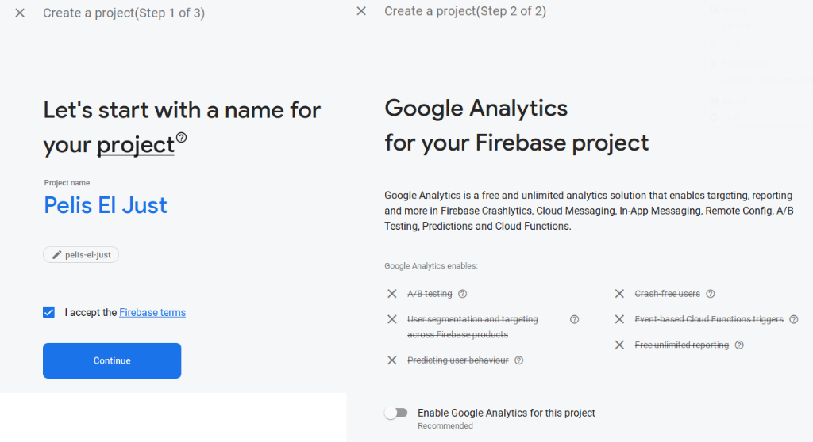
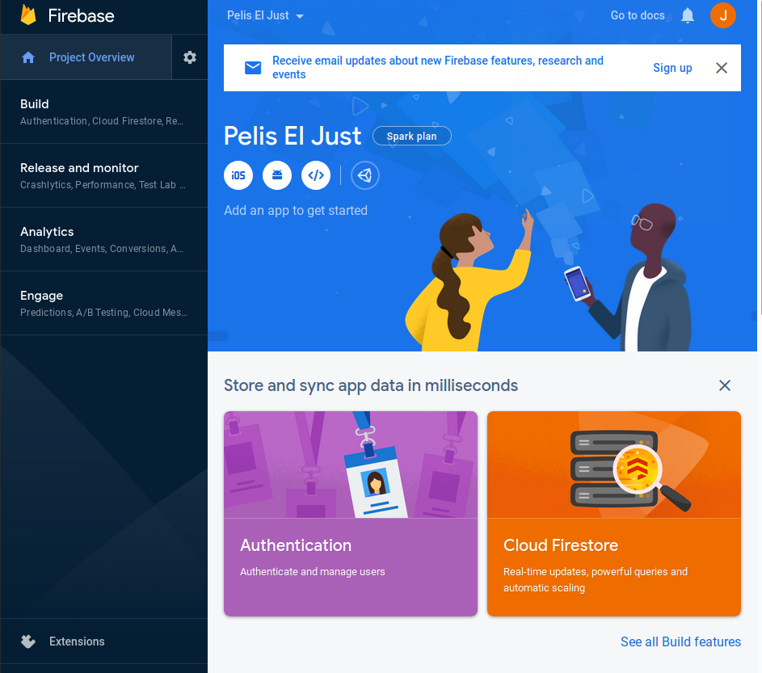
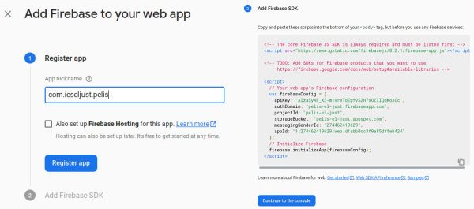
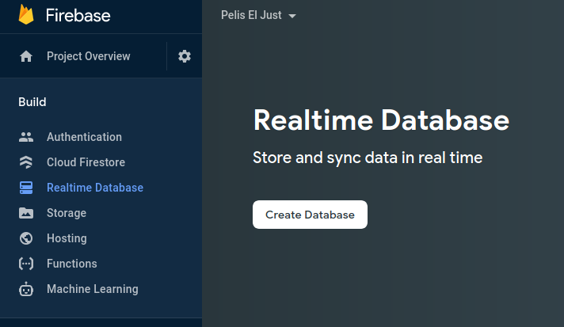
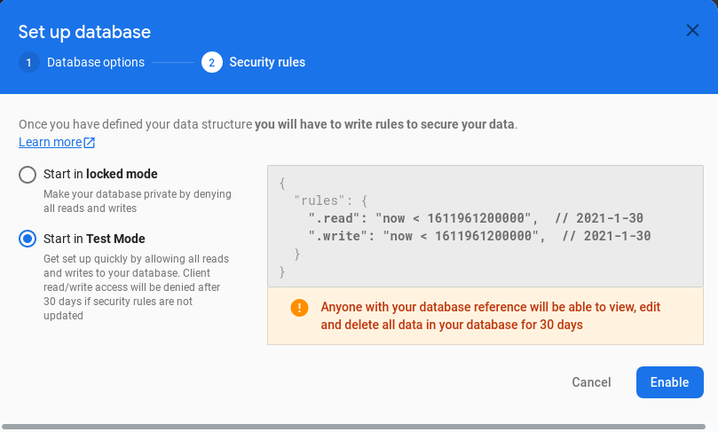
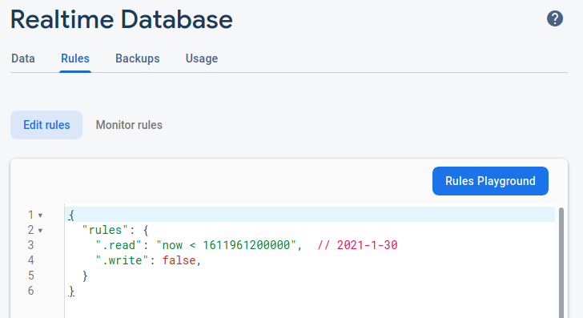
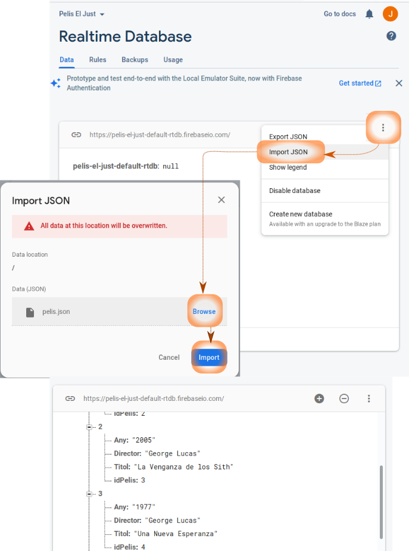
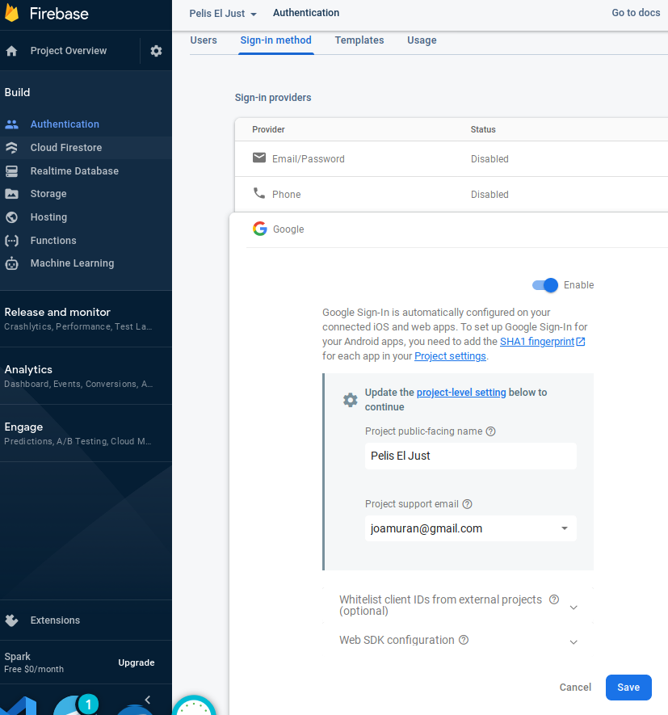
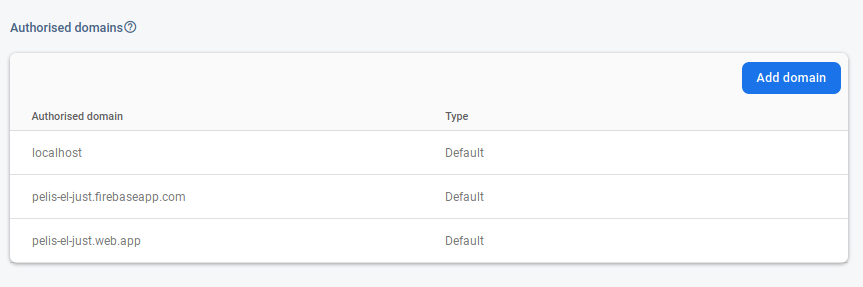

## Introducció

Aquest document té un doble objectiu:

* Per una banda, que veieu com realitzar aplicacions mòbils amb tecnologies web, de forma molt semblant a com féiem amb Electron per a l'escriptori, fent ús de *Capacitor*.
* I per altra banda, prendre contacte amb Firebase, una plataforma al núvol per al desenvolupament d'aplicacions web i mòbils.

Per a això, veurem un xicotet exemple en què farem ús d'ambdues tecnologies.

## Firebase

[Firebase](https://firebase.google.com/) és una plataforma per al desenvolupament d'aplicacions, tant web com mòbils, desenvolupada per Google (i integrada amb *Google Cloud Platform*) que ofereix un conjunt d'eines per crear i sincronitzar projectes. Algunes d'aquestes eines són:

* **Firebase Analytics**: Aplicació gratuita per tindre una visió de l'ús de l'aplicació per part dels usuaris,
* **Firebase Cloud Messaging**: Una plataforma per enviar missatges i notificacions per a Android, iOS i web, actualment d'ús gratuit.
* **Firebase Auth**: Servei per autenticar els usuaris fent ús només de codi al costat del client. Inclou autenticació mitjançant Facebook, GitHub, Twitter, Google, Yahoo o Microsoft, a banda dels mètodes clàssics de correu electrónic i contrassenya. 
* **Realtime Database**: Una base de dades en temps real, al backend (costat del servidor), i organitzada en format JSON (NoSQL). Permet la integració nativa amb diversos sistemes i una API REST per al seu accés. Aquesta sincronització de la BD en temps real permet que els usuaris accedisquen a la informació des de qualsevol dispositiu, compartint una instància de la BD, i observen en temps real totes les modificacions que s'hi produeixen sobre ella. A més, si es perd la connexió a Internet, l'SDK de la plataforma utilitza la caché local del dispositiu per emmagatzemar els canvis, de manera que es sincronitzen quan es torna a tindre connexió.
* **Firebase Storage**: Permet la càrrega i descàrrega segura de fitxers per a aplicacions Firebase, sense importar la qualitat de la xarxa. Es poden emmagatzemr imatges, video o qualsevol tipus de contingut generat per l'usuari, que s'emmagatzemarà al *Google Cloud Storage*.
* **Firebase Cloud Firestore**: És altre servei d'emmagatzemament derivat de *Google Cloud Platform*, adaptat a Firebase. D'igual manera que la BD en temps real és una base de dades NoSQL, però organitzada en forma de documents agrupats en col·leccions (com en MongoDB), que permet camps de diversos tipus, així com subcol·leccions.

En aquest exemple, anem a seguir l'article *[Empezando con Firebase (Realtime Database & Authentication)](https://medium.com/@margalida.kaskante/empezando-con-firebase-realtime-database-authentication-a5c54b3b67d6)*, per crear un sistema d'autenticació i una base de dades mitjançant FireBase, a la que accedirem a través d'una pàgina web *responsive*. Al següent apartat, ja veurem com *convertir* aquesta pàgina en una aplicació.

### Començant amb Firebase

El primer que farem serà crear un projecte des de la consola de Firebase. Per a això:

1. Accedim a [https://console.firebase.google.com/](https://console.firebase.google.com/)
2. Ens loguem (si ja tenim un compte de Google actiu al navagador accedirem directament)
3. Creem un projecte (*Create a project*). Quan fem click en aquest botó ens apareixerà un assistent on se'ns demanarà el nom i si volem activat Google Analytics (de moment no ens farà falta).



Podeu consultar l'article [Empezando con Firebase (Realtime Database & Authentication)](https://medium.com/@margalida.kaskante/) per veure alguns gifs animats del procés, encara que amb una interfície anterior.

4. Una vegada creat el projecte, ens apareixerà el panell principal d'aquest:

{ width=450px }

* A la part superior, baix el títol del projecte, veureu que apareixen diverses icones (iOS, Android, Web i Unity), i baix el text *Add an app to get started*. Com veieu, Firebase ofereix suport per a totes aquestes plataformes. Com que anem a fer una aplicació web, seleccionarem la icona corresponent (`</>`), i ens apareixerà un diàleg preguntnt-nos el sobrenom de l'aplicació, per registrar-la, i si volem activar el *Firebase Hosting* (de moment li diem que no.). Fem clic en *Register App* quan hajam introduit el nom.

* Fet açò, el segon pas *2. Add Firebase SDK* ens mostra un script a afegir a la nostra aplicació web, per tal d'accedir als serveis de Firebase:

{ width=300px }

* Ens guardem l'script per afegir a la nostra aplicació posteriorment (tot i que el podrem consultar a l'apartat de *Settings*), i fem clic a *Continue to the console*.

5. Anem a **crear la base de dades**. En el menú de la dreta, fem click en l'opció *Realtime Database* i després en *Crate Database*. 

{ width=250px }

* Ens apareixerà un diàleg per preguntar-nos on ubicar la BD (podem deixar l'opció per defecte), i les regles de seguretat per a la BD. Definirem aquestes amb l'opció *Start in **Test Mode***, de manera que tothom amb la referència a la base de dades tinga accés durant un temps determinat. 

{ width=400px }

* Fem click en **Enable** per activar la base de dades 

6. Una vegada en la secció de la BD de la consola, anem a modificar les regles, per permetre lectures però no escriptures, així doncs, en la secció *Rules*, deixarem els permisos de lectura com estàven (amb un mes de validesa), i posarem a *false* els permisos d'escriptura. Per acceptar els canvis farem click en *Publish*.

{ width=400px }

7. Ara, per afegir dades, a la mateixa finestra on estàvem, seleccionem la pestanta *Data* i localitzem, a prop de la URL de la base de dades la icona dels tres puntets per obrir el menú d'opcions de la base de dades. Obrim el menú i seleccionem l'opció *Import JSON*. Ens apareixerà un selector de fitxers, i seleccionarem el fitxer *pelis.json* que se us proporciona als fonts. Fet això, li donem a *Import*, i si tot ha ant bé i el fitxer té el format correcte, ens haurà afegit la informació a la base de dades.

{ width=500px }

> 
> **Referències i lectures interessants**
>
> * [Firebase a la Wikipedia](https://es.wikipedia.org/wiki/Firebase)
> 
> * [Empezando con Firebase (Realtime Database & Authentication)](https://medium.com/@margalida.kaskante/empezando-con-firebase-realtime-database-authentication-a5c54b3b67d6)


### Afegint el codi al projecte

La nostra aplicació tindrà una estructura bastants simple, amb un `index.html`, una carpeta per als CSS i altra per a JS, amb un `index.js` que implementarà tota la funcionalitat.

Per tal de carregar tot el que necessitem per accedir a la BD en temps real de Firebase, afegirem, abans de tancar l'etiqueta `</body>` els següents scripts:

```html

<!-- The core Firebase JS SDK is always required and must be listed first -->
<script defer src="https://www.gstatic.com/firebasejs/8.2.1/firebase-app.js"></script>

<script defer src="https://www.gstatic.com/firebasejs/8.2.1/firebase-database.js"></script>

<!-- Carreguem els nostres scripts -->
<script defer src="./js/index.js"></script> 
```

El primer carrega el SDK de Firebase des dels CDN (*Content Delivery Network* o *xarxa de distribució de continguts*) de Google. El segon que carreguem és el plugin per treballar amb la base de dades *realtime* de firebase i finalment, carreguem el nostre script.

El paràmetre `defer` és introduït en HTML5, i permet carregar l'script de forma asíncrona, paral·lelament a l'anàlisi de l'HTML per generar el DOM, de manera que no bloqueja el renderitzat d'aquest. L'execució dels diferents scripts serà diferida fins que es tinga el DOM generat, i s'executaran en l'ordre en que apareixen al document.

El fitxer `index.js` conté la classe *DBPelis*, que s'encarregarà de tota la funcionalitat de l'aplicació. Passem a veure els diferents mètodes relacionats amb la càrrega de la BD i la seua visualització.

***Inicialització de Firebase i la BD***

El propi constructor de la classe serà qui configure la connexió a *Firebase*, d'acord amb els paràmetres subministrats quan hem creat l'aplicació. A més, després d'inicialitzar Firebase amb aquesta configuració, definirem una connexió al servei de la base de dades, que ens guardarem dins l'atribut de la classe *firebaseDB*:

```js
 constructor() {
        // Your web app's Firebase configuration
        var firebaseConfig = {
            // Aci apeguem la informació que ens ha subministrat
            // Firebase per a la connexió: apiKey, authDomain,
            // projectId, storageBucket, messagingSenderId i  appId.
        };
        // Initialize Firebase
        firebase.initializeApp(firebaseConfig);

        // Constant global per accedir al servei de BD
        this.firebaseDB = firebase.database();
 }
 ```

 ***Obtenció dels registres de la BD***

 El mètode que llegeix la base de dades és `getAllPelis`, i té el següent codi:

 ```js
getAllPelis(callback) {
    let refArrel = this.firebaseDB.ref()
    refArrel.once('value', snapshot => {
        callback(snapshot.val().pelis)
    });
}
```
Recordeu que la base de dades és de tipus NoSQL, i s'emmagatzema en forma d'arbre JSON. Per tal d'obtenir doncs tots els registres de la BD, el que farem és obtenir una referència a l'arrel de l'arbre (amb el mètode `ref()` de la base de dades), i preparant un *callback*, per a quan es reba un valor (`value`) mitjançant el mètode `once`. El que obtenim és un `snapshot` de la BD. Per tal d'obtenir el seu valor ho fem mitjançant el mètode `val()` que ens retorna el JSON, i d'aquest ens interessa el node principal *pelis*. Amb aquest node arrel, el que fem és invocar una funció de callback que se'ns ha proporcionat. Veiem què fem al codi principal de l'aplicació per carregar els registres per entendre-ho millor:

```js
let myDB = new DBPelis();
myDB.getAllPelis(function (pelis) {
    myDB.drawCards(pelis);
})
```

Amb açò, hem creat un objecte de tipus DBPelis, i hem invocat el seu mètode `getAllPelis`. Com veiem, la funció de callback que li hem proporcionat conté una invocació al mètode `drawCards` de la classe, passant-li l'argument `pelis` que és el que haurem obtingut després de fer la consulta a la base de dades. Ens queda només veure com es realitza aquest *Renderitzat* de les diferents pelis a la interfície.

***Renderitzat de les pel·lícules***

Els dos mètodes encarregats del renderitzat de les pel·lícules són `drawCards(pelis)` per al renderitzat general de les pel·lícules, i `createCard(peli)`, que serà utilitzat per *drawCards* i que renderitza una única pel·lícula:

```js
drawCards(pelis) {
    for (let peli of pelis){
    let card=this.createCard(peli)
    document.querySelector("#pelisCards").append(card);
    }
}
```

Com veiem, aquest mètode recorre la llista de *pelis*, i per a cadascuna crea un objecte *card* que serà un objecte del DOM, i que afegirem al document dins l'element marcat per l'id `#pelisCards`. Si ens fixem en l'HTML, aquest element és un div buit que ja hem preparat a l'HTML per afegir les targetes amb les pel·lícules:

```html
<div class="container">
    <h3>Llistat de pel·lícules</h3>    
    <div id="pelisCards"></div>
</div>
```

Ara ens queda veure el mètode per crear cadascuna de les targetes, però abans, anem a veure un xicotet tros de codi HTML per entendre-ho millor. Al fitxer *index.html* tenim el següent:

```html
<template class="pelis">
<div class="card">
    <div class="card-body">
      <h5 class="card-title"></h5>
      <p class="card-text"></p>
    </div>
</div>
</template>
```

Com veiem, es tracta d'una etiqueta `<template>`. Aquestes etiquetes són introduïdes en HTML5, i són etiquetes que no es renderitzen per elles mateixa, sinò que ens serveixen per definir una estructura que servirà de plantilla per generar elements.

La generació dinàmica d'elements al DOM es pot fer de diverses formes, estant entre les més habituals la creació de l'HTML en forma de text o la creació d'elements del DOM amb `createElement`. L'ús de plantilles és un mecanisme introduït en HTML5, i que ens permet definir l'estructura per una banda, al propi HTML, i reutilitzar-la des del codi Javascript tantes vegades com necessitem.

Veiem doncs com utilitzar aquest mecanisme al mètode *createCard*:

```js
createCard(peli){
    const plantilla=document.querySelector("template.pelis");
    const card = document.importNode(plantilla.content, true);
    card.querySelector(".card-title").innerText=peli.Titol;
    card.querySelector(".card-text").innerText=peli.Director+" ("+peli.Any+")";
    return card;
}
```

Com veiem, el que hem fet és primerament, obtenir una referència a la plantilla, buscant al document l'etiqueta *template* amb classe *pelis* (`querySelector` selecciona nodes proporcionant-li un selector CSS).

Una vegada tenim referenciada la plantilla, amb `importNode` la *importem* per utilitzar-la al nostre document. El segon paràmetre és un booleà que indica si volem importar les etiquetes internes. El posem a *true* perquè volem tota l'estructura.

Amb l'element importat, en la constant *card* (aquesta és una referència a l'element del DOM, pel que encara que siga constant, el contingut es pot modificar) buscarem els elements amb classe *card-title* i *card-text* per tal d'emplenar-les amb la informació de la pel·lícula, i finalment, retornem aquest objecte per tal d'afegir-lo al contenidor principal.

Amb tot açò, ja tindrem funcionant l'aplicació simplement carregant el fitxer `index.html` en un navegador.

>
> ***Documentació***
>
> [Afegint Firebase a un projecte Javascript](https://firebase.google.com/docs/web/setup#available-libraries)
>
> [Instal·lació i configuració de Firebase Realtime Database en Javscript](https://firebase.google.com/docs/database/web/start)
>

### Autenticació

Firebase ens permet implementar l'autenticació en qualsevol projecte ja siga web o una app. Sovint, necessitarem conéixer la identitat dels nostres usuaris per tal d'emmagatzemar de forma segura les seues dades en el núvol i oferir-los una experiència personalitzada.

Amb Firebase tenim la possibilitat d'autenticar els usuaris a través de dieferents proveïdors: Google, Facebook, GitHub o Twitter entre molts d'altres. La integració és senzilla, com veurem a continuació.

A l'article que hem començat a seguir en l'apartat anterior, es realitza l'autenticació mitjançant usuari i contrassenya. Al nostre cas, anem a utilitzar l'autenticació a través d'un proveïdor d'identitats, com puga ser Google.

***Habilitar l'autenticació amb Google***

En primer lloc, hem d'accedir a la consola del nostre projecte, i activar l'autenticació. Ho farem a través de l'opció del menú *Authentication* > *Sign-in method* > *Google*. I posarem l'autenticació com a *Enabled*. En aquest punt, és possible que ens demane completar la configuració amb el nostre correu:

{ width=500px }

No ens oblidem de fer clic al botó ***Save*** quan acabem de fer la configuració.

Per altra banda, també cal configurar des d'on ens podem connectar a la nostra aplicació. Si ens fixem, més avall de la configuració dels proveïdors d'identitats, tenim una secció amb els *Dominis Autoritzats* (*Authorized domains*) que poden accedir a l'aplicació. 

{ width=500px }

Una cosa que cal tindre en compte és que es tracta de dominis que accediran a l'aplicació **a través del protocol HTTP**, de manera que no podrem accedir mitjançant `file://`, com hem vingut fent (és a dir, obrint directament el fitxer des del nostre sistema). **Necessitarem per tant ubicar l'aplicació en un servidor web**.

***Muntar un servidor web amb Nodejs***

Amb NodeJS és molt fàcil muntar un servidor web senzill, fent ús de la llibrería Express. Per a això cal iniciar un nou projecte amb Node, importar la llibreria *Express* i crear el codi del servidor.

Per a això, dins el directori *pelisFirebase*[^1] buït, fem: 

[^1]: Compte si ho feu tot de zero, que aquet era el mateix directori que haviem utilitzat al projecte de la web

1. Creació del projecte (deixem totes les opcions per defecte)

```
pelisFirebase$ npm init
This utility will walk you through creating a package.json file.
It only covers the most common items, and tries to guess sensible defaults.
...
```

2. Instal·lem la llibreria express:

```
$ npm install express
npm WARN pelisfirebase@1.0.0 No description
npm WARN pelisfirebase@1.0.0 No repository field.

+ express@4.17.1
added 50 packages from 37 contributors and audited 50 packages in 4.701s
found 0 vulnerabilities
```

3. Creem el fitxer `index.js` amb el següent contingut:

```js
const express = require('express')
const app = express()

// Amb això servim el directori app com 
// si fos el DocumentRoot.
app.use('/', express.static('app'));

app.listen(8080)
```

Com veiem, es tracta d'un codi bastant curs, i en el que importem la llibreria Express, i configurem el servidor web Express per a que servisca pàgines web estàtiques ubicades al directori `app`. A més, el nostre servidor escoltarà peticions pel port 8080. Aprodundirem més sobre aquest codi a la última unitat de PSP sobre serveis REST.

4. Creem el directori `app`, i afegim en ell el projecte on teniem la pàgina web, de manera que l'estructura de carpetes ens quedarà:

```
pelisFirebase
    |-- app    -> Carpeta de l'aplicació (arrel del servidor web)
    |   |-- css
    |   |   `-- custom.css
    |   |-- index.html
    |   |-- js
    |   |   `-- index.js
    |   |-- node_modules  -> Llibreries de l'aplicació
    |   |-- package.json  -> Paquet de l'aplicació
    |   `-- package-lock.json
    |-- index.js          -> Script del servidor web
    |-- node_modules      -> Llibreríes del servidor web
    |-- package.json      -> Paquet del servidor
    `-- package-lock.json

```

Com veiem, tenim dos fitxers `package.json`, dos carpetes `node_modules`... ja que tenim per una banda el projecte del servidor web, i per altra la  nostra aplicació web a dins el servidor.

5. Finalment, modifiquem el fitxer `package.json` del servidor amb el següent script d'arrencada:

```json
...
 "scripts": {
    "start": "nodejs ."
  },
...

```

Amb això, quan fem un `npm start`, deixarem en marxa el servidor (sense aturar aquest procés), i podrem accedir a ell a través de la URL `http://localhost:8080/`. **Tingueu en compte que als dominis que hem configurat a Firebase teníem el domini *localhost*, però no l'adreça *127.0.0.1*, pel que no podrem accedir a l'autenticació si ho fem indicant la IP**.

Bé, una vegada habilitada l'autenticació i els dominis en Firebase i muntada l'aplicació sobre un servidor web, cal veure com gestionem el flux d'accés a l'aplicació fent ús de l'SDK de Firebase.

***Afegint l'autenticació a l'aplicació***

Per tal de realitzar l'autenticació mitjançat un proveïdor d'identitats, en primer lloc, haurem de crear una instància de l'objecte del proveïdor corresponent. En aquest cas, de Google:

```js
var provider = new firebase.auth.GoogleAuthProvider();
```

Amb açò, Firebase ens ofereix un objecte a través del qual autenticar-nos en Google. La forma d'accés es pot fer a través d'una finestra emergent (recomanat en aplicacions web en el navegador) o bé redireccionant a la pàgina d'accés (recomanat en qualsevol altre cas). Utilitzarem aquest segon mètode. Així doncs, quan volguem autenticar-nos, farem ús del mètode `SignInWithRedirect` de la següent forma:

```js
firebase.auth().signInWithRedirect(provider);
``` 

I per recuperar el *token* d'autenticació del proveïdor d'identitats, invoquem a `getRedirectResult` una vegada carregada la pàgina. Aquest mètode ens retorna una *Promesa*, un objecte que representarà la finalització o fracàs d'una operació asíncrona.

Fins ara, hem vist com gestionar l'asincronía mitjançant funciona de callback. És a dir, quan invoquem una funció asíncrona, li proporcionem una funció (*funció de callback, fletxa o lambda*) que s'executarà quan acabe la primera funció. Aquest funcionament, com vam comentar pot suposar que el codi font acabe fent-se complex de llegir, i puga provocar *inversió d'autoritat* (funcions que s'invoquen després de diversos anidaments acaben executant codi principal). Per evitar estos problemes van aparéixer les promeses (hi ha també més mecanismes posteriors, com *async/await*, però no les veurem). 

Una promesa, com hem comentat, és un tipus d'objecte que, com hem dit, representa l'estat de finalització d'una funció asíncrona. Aquest objecte ofereix el mètode `then`, que  té com a arguments dos funcions de callback: la primera que s'invocarà quan acabe amb èxit l'operació asíncrona, i la segona, que és opcional, s'invocarà en cas d'error. A més, podem *encadenar* diferents callbacks per evitar anidar callbacks. 

Per veure-ho gràficament, el que amb callbacks expressariem com a:

```js
func1( () => {
    func2( () => {
        func3( () => {
            func4( () => {
                //....
            }
        }
    }
})
```

Amb promeses quedaria:

```js
func1().then(()=>{
        func2();
    })
    .then(()=>{
        func3();
    })
    .then(
    ()=>{
        func4();
    });
```

En essència, una promesa és doncs un objecte retornat per una funció asíncrona, al qual li podem associar diferents funcions de callback, en lloc de passar callbacks a la funció.

El mètode `getRedirectResult` fa ús de les promeses de la següent forma:

```js

    firebase.auth().getRedirectResult().then(result => {
        // Funció de callback quan acage getRedirectResult
    });
```

Com veiem, bàsicament hem afegit la funció de callback que hauriem inclòs com a paràmetre dins el mètode then. Aquest callback rep un resultat (*result*) amb les credencials de l'usuari.

Amb tot açò, el codi per gestionar l'autenticació queda bàsicament:

```js
    /* Autenticació */

    // Seleccionem Google com a proveïdor d'identitats:
    var provider = new firebase.auth.GoogleAuthProvider();

    // ...

    // Quan fem clic al botó de login (amb id #loginBt), 
    // redireccionarem a la pàgina d'autenticació de Google:
    document.querySelector("#loginBt").addEventListener("click", function () {
        firebase.auth().signInWithRedirect(provider);
    })

    // I ara, esperem a tindre un resultat. Quan ens torne 
    // la promesa, obtindrem les dades de l'usuari, i aquest
    // ja estarà registrat.
    firebase.auth().getRedirectResult().then(result => {
        // Per tal d'obtenir les dades de l'usuari
        // fem ús de firebase.auth().currentUser, 
        // en cas que result siga nul. Ens quedem amb 
        // el nom i la imatge de l'usuari.
        if (result.user || firebase.auth().currentUser) {
            let user = firebase.auth().currentUser;
            let name = user.displayName;
            let photoUrl = user.photoURL;

            // Configurem i mostrem el nom i la imatge d'usuari, 
            // així com el botó de logout 
            // [...]

            // I una vegada logat l'usuari, ja accedima carregar
            // la base de dades.
            myDB.getAllPelis(function (pelis) {
                document.querySelector(".loader").style.display="none";
                myDB.drawCards(pelis);
            })
            
        }
    });
```

***Manipulació del DOM***

Al codi font original hi ha més codi dins el callback de la funció `getRedirectResult`, que s'encarregarà de manipular el DOM (el model del document), per mostrar o ocultar la barra superior on apareix el nom i la foto de l'usuari junt amb el botó de logout, o simplement un botó de login. 

Per veure com fa açò, fixem-nos en el codi HTML de la barra superior:

```html
<nav class="navbar navbar-dark bg-primary userbar">
    <!--
        Fragment que mostrarem quan l'usuari estiga logat
     -->
    <div>
      <span class="username" id="username"></span>
      
    </div>
    <button class="btn btn-sm btn-outline-light" id="logoutBt">
      <span class="iconify" data-icon="mdi-logout" data-inline="false"></span> logout</button>

    <!--
        Fragment que mostrarem quan l'usuari NO estiga logat
     -->

    <button class="btn btn-sm btn-outline-light" id="loginBt">
      <span class="iconify" data-icon="mdi-login" data-inline="false"></span> login</button>
  </nav>
```

Amb això, quan l'usuari no està logat, mostrarem només el botó de *Login*, mentre que quan estiga logat, mostrarem el nom, la imatge, i el botó de logout. El mostrar o ocultar elements ho farem a través de la propietat CSS `display` (podeu consultar el codi CSS per veure els ids que apareixen inicialment com a `display: none`, de manera que no es mostren).

Així doncs, quan l'usuari s'autentique en l'aplicació, el que fem és mostrar aquests elements, i donar-los valor:


```js
// Configurem i mostrem el nom i la imatge d'usuari, així com el botó de logout
document.querySelector("#username").innerText = name.split(" ")[0];
document.querySelector("#imageProfile").src = photoUrl;
document.querySelector("#username").style.display = "inline";
document.querySelector("#imageProfile").style.display = "inline";
document.querySelector("#logoutBt").style.display = "inline";
document.querySelector("#loginBt").style.display = "none";            
```

Algunes consideracions:

* Per accedir a un element del DOM fent ús de selectors CSS (*#id*, *.classe*), fem ús del mètode `document.querySelector`. 
* Per modificar el node de text d'un element HTML utilitzem la propietat `innerText`. En aquest cas, per mostrar només el nom (sense cognoms), fem un `split` del nom que ens ha proporcionat Google, i ens quedem amb el primer element.
* Per modificar la font de la imatge, utilitzem la propietat `src` de l'element ``.
* Per mostrar els elements, ho fem modificant la propietat `style.display`, i la posem a *inline* (podríem posar-la com a *block*, però en eixe cas, ocuparien tota una línia, cosa que novolem).
* De la mateixa manera, per ocultar elements (botó de login), posem `style.display` a *none*.

Ara, només ens queda veure com gestionem el botó de *Logout*:

```js
document.querySelector("#logoutBt").addEventListener("click", function () {
    document.querySelector("#username").style.display = "none";
    document.querySelector("#imageProfile").style.display = "none";
    document.querySelector("#logoutBt").style.display = "none";
    document.querySelector("#loginBt").style.display = "inline";
    firebase.auth().signOut();
    window.location.reload();
})
```

Com veiem, associem un escoltador d'events al botó de logout (`#logoutBt`), i en fer clic en aquest:

* Ocultem el nom, la imatge de perfil i el botó de logout, i mostrem el botó de login
* Fem ús del mètode `firebase.auth.signOut()` de l'SDK de Firebase per tancar la sessió,
* Recarreguem la pàgina, per tornar a mostrar la finestra en blanc, ocultant els resultats de la BD.


>
> **Documentació útil de Firebase**
> 
> * [https://firebase.google.com/docs/auth/web/google-signin](https://firebase.google.com/docs/auth/web/google-signin)
>
> * [https://firebase.google.com/docs/auth/web/manage-users?hl=es](https://firebase.google.com/docs/auth/web/manage-users?hl=es)
>

## Aplicacions mòbils amb Capacitor

En aquest segon gran apartat d'aquesta unitat anem a abordar el desenvolupament d'aplicacions per a dispositius mòbils amb tecnologies web.

Com a una primera aproximació, al primer apartat hem creat una aplicació web *responsiva*, amb HTML, Javascript i CSS, fet ús del framework Bootstrap per adaptar els continguts a diferents dispositius.

A aquesta aplicació accedim directament a través del navegador web del propi dispositiu. Si volguérem generar una aplicació Android amb aquesta aplicació, podríem crear una aplicació consistent en una activitat amb un component *WebView* que ocupara tot el *Layout* i que accedira a la web en qüestió.

Amb esta idea en ment, i amb la intenció que fos multiplataforma van aparéixer les tecnologies d'Apache Cordova i Adobe Phonegap, donant pas al que es consideraríen aplicacions híbrides, al donar accés a algunes deles APIs natives dels dispositius. Més recentment va aparéixer el framework *Ionic*, basat en Cordova, com a una forma d'adaptar el framework *Angular* al món mòbil. 

Actualment, la comunitat de Ionic ha desenvolupat *Capacitior*, com a un substitut d'Apache Cordova. A més, des d'octubre d'aquest 2020 Adobe Cordova i Adobe Phonegap han aturat el seu desenvolupament, al·legant la irrupció al mercat de les aplicacions web progressives (PWA), que no requereixen fins i tot ni connexió a Internet.

Capacitor ens permet generar aplicacions mòbils amb tecnologia web de forma semblant a com esfeia amb Apache Cordova (la base de funcionament és la mateixa), però aporta alguns avantatges. A més, a diferència d'Ionic, no necessitem conéixer altres frameworks com Angular, pel que podrem fer aplicacions híbrides, però també progressives (PWA) amb Javascript estàndard. 
 
 A les referències del final de la unitat podeu trobar més informació sobre la discontinuïtat de Cordova i Capacitor.

### Instal·lació de Capacitor

Anem a realitzar la instal·lació seguint els pasos indicats a la documentació oficial de Capacitor [https://capacitorjs.com/docs/getting-started/](https://capacitorjs.com/docs/getting-started/). Podeu consultar aquesta documentació per obtindre informació més detallada del procés.

Abans de realitzar la instal·lació ens hem d'assegurar que disposem de les versions de node i npm adequades. Per a la versió actual de Capacitor necessitarem *node* amb una versió > 8.6.0 i *npm* amb una versió > 5.6.0.

A més, si volem desenvolupar una aplicació per a iOS necessitarem un Mac amb Xcode en una versió > 11, i per a Android, necessitarem l'SDK d'Android que ve amb l'Android Studio, i els dispositius emulats hauran de disposar d'una API al menys de nivell 21 (Android 5.0)

Per tal de crear una aplicació amb Capacitor podem optar per dues víes: Afegir Capacitor a un projecte web existent o bé començar un projecte de zero, mitjançant la CLI de Capacitor. Com que ja tenim creada l'aplicació web, anem a optar per la primera opció.

***Creació d'un nou projecte i Instal·lació de Capacitor***

El primer que farem serà crear el directori *pelisCapacitor* per al nostre projecte, i crear un projecte nou en ell:

```
$ mkdir pelisCapacitor
$ cd pelisCapacitor
$ npm init
```

Podem deixar totes les opcions que ens suggereix per omissió l'assistent d'*npm*.

Una vegada creat el fitxer index.json amb l'`npm init` anterior, anem a fer una còpia de la nostra aplicació web (només la carpeta `app`, no el servidor Express) i la renomenarem com a `wwwp que és el nom habitual que utilitzarà Capacitor per al contingut web. El contingut d'aquestes carpetes serà:

```
pelisCapacitor/
|-- package.json
`-- www
    |-- css
    |-- index.html
    |-- js
    |-- node_modules
    |-- package.json
    `-- package-lock.json
```

Fixeu-vos que tenim dos `package.json`: per una banda el del projecte Capacitor i per altra el web.

>
> **Modificacions al codi**
>
> Per tal de simplificar l'exemple, anem a modificar el codi javascript inicial per tal d'accedir a la base de dades de FireBase però eliminarem tota la part d'autenticació.
>
> El fet d'ometre l'autenticació en aquest punt és degut a que aquesta resulta un tant problemàtica, i cal fer ús de plugins i configuracions més específiques.
>
> Per tant, al fitxer *index.html* eliminarem l'element `<nav>` que conté la barra superior i al fitxer js/index.js, modificarem la funció `window.onload` per eliminar tot el codi referent a lautenticació, deixant-la d'aquesta manera:
>
> ```js
> window.onload = function () {
>
>    let myDB = new DBPelis();
>    myDB.getAllPelis(function (pelis) {
>      myDB.drawCards(pelis);
>    })
>}
>```
>

Una vegada modificat el codi de base, anem a afegir *Capacitor* a aquesta aplicació web. Per a això, des del directori *pelisCapacitor* instal·lem Capacitor i la CLI:

```
$ npm install @capacitor/core @capacitor/cli
```

I ara inicialitzarem Capacitor amb informació sobre l'aplicació:

```
npx cap init
```

La utilitat `npx` ve amb npm a partir de la versió 5, i ens permet executar scripts i binaris de forma local, sense haver de realitzar una instal·lació global.

L'ordre `npx cap init` ens demanarà tant el nom de l'aplicació, com el seu id (nom del paquet). Per defecte, el contingut web s'ubicarà en un directori anomenat `www` però podem canviar-lo indicant el flag `--web-dir` a l'ordre d'inicialització.

```
$ npx cap init
? App name peliscapacitor
? App Package ID (in Java package format, no dashes) com.iesekjust.pmdm.peliscapacitor
✔ Initializing Capacitor project in /home/joamuran/dev/pelisCapacitor in 4.86ms


🎉   Your Capacitor project is ready to go!  🎉

Add platforms using "npx cap add":

  npx cap add android
  npx cap add ios
  npx cap add electron

Follow the Developer Workflow guide to get building:
https://capacitorjs.com/docs/basics/workflow

```

Ara, com ens indica la pròpia eixida d'inicialització del projecte, hem d'instal·lar la plataforma de destí. Fixeu-vos que a banda d'Android i ios també podem exportar a electron, per fer una aplicació d'escriptori.

Anem a afegir la plataforma Android:

```
$ npx cap add android
✔ Installing android dependencies in 2.07s
✔ Adding native android project in: /home/joamuran/dev/pelisCapacitor/android in 37.40ms
✔ Syncing Gradle in 570.44μp
✔ add in 2.11s
✔ Copying web assets from www to android/app/src/main/assets/public in 150.51ms
✔ Copying native bridge in 813.27μp
✔ Copying capacitor.config.json in 2.37ms
✔ copy in 162.47ms
✔ Updating Android plugins in 710.36μp
  Found 0 Capacitor plugins for android:
✔ update android in 12.32ms

Now you can run npx cap open android to launch Android Studio
```

Fixeu-vos en tota la informació que ens dóna l'eixida d'aquesta ordre:

* Ha creat una carpeta *android* dins la carpeta *pelisCapacitor* amb el projecte natiu amb Android,
* Ha copiat tot el contingut que teníem al directori *www* a *android/app/src/main/assets/public*,
* Ha copiat algunes coses més al projecte, com el pont natiu (*native bridge*), un fitxer de configuració de capacitor (*capacitor.conf.json).

L'eixida anterior també ens comenta que si volem obrir Android amb aquest projecte llancem `npx cap open android`. Però abans d'això, per tal que Capacitor sàpiga on tenim instal·lat Android Studio ho hem d'indicar amb la clau `linuxAndroidStudioPath` al fitxer `capacitor.config.json`. Per exemple, si l'hem instal·lat amb Ubuntu Make, afegirem

```json
{...
  "linuxAndroidStudioPath": "/home/nom_usuari/.local/share/umake/android/android-studio/bin/studio.sh"
}
```

Amb açò modificat, ja podrem obrir el projecte amb l'Android Studio:

```
npx cap open android
```

La primera vegada que obrim el projecte és possible que es prenga un temps, ja que ha de realitzar tota la sincronització de Gradle. 

Una vegada sincronitzat i carregat, podem veure l'estructura d'aquest i executar-lo:

[Projecte amb Android Studio](imgs/AndroidStudio.png)

En aquesta captura podem apreciar vàries coses:

* Pel que fa a l'estructura, centrant-nos en al mòdul `app`, veiem que es tracta d'una estructura típica d'aplicació Android, amb els seus Manifests, i les carpetes *java* amb el codi i *res* amb els recursos. 
* A més d'aquestes, tenim una nova carpeta *assets* que conté el fiter de configuració de Capacitor i una carpeta *public* que conté el codi font amb HTML i JS de la nostra aplicació web.
* Si ens fixem al codi Java i al recursos, veurem que hi ha una activitat MainActivity, el Layout de la qual consta principalment d'un webview.

### Consideracions finals

En aquet document hem vist com crear una aplicació web híbrida que s'executa dins un WebView en el nostres projectes Android.

Si en algun moment modifiquem el contingut del directori `www` des de fora, o bé afegim algun plugin o modifiquem la configuració del projecte, cal propagar els canvis a la carpeta *android* amb:

```
npx cap sync
```

Si desitjàrem utilitzar també l'autenticació, hauriem d'utilitzar el plugin *capacitor-firebase-auth* al nostre projecte de Capacitor, configurar els proveïdors d'identitats a la configuració de Capacitor, configurar Firebase per tal de permetre l'accés des d'Android, i modificar diversos fitxers de configuració de Gradle per afegir dependències i accedir als serveis de Google. Podeu consultar la documentació addicional si ho considereu interessant.

> 
> **Documentació Addicional i referències**
>
> * [Documentació de Capacitor](https://capacitorjs.com/docs)
>
> * [Capacitor, el nuevo Apache Cordova](https://alotroladodeltelefonoblog.wordpress.com/2020/02/01/capacitor-el-nuevo-apache-cordova/)
>
> * [Adobe discontinued Phonegap](https://medium.com/better-programming/adobe-discontinued-phonegap-d0770179ba3c)
>
> * [Plugin capacitor-firebase-auth](https://github.com/baumblatt/capacitor-firebase-auth#readme)
>
> * [Afegint Firebase a projectes d'Android](https://firebase.google.com/docs/android/setup)
>
> * [Autentica mediante proveedores de OAuth con Cordova](https://firebase.google.com/docs/auth/web/cordova?hl=es)
>
